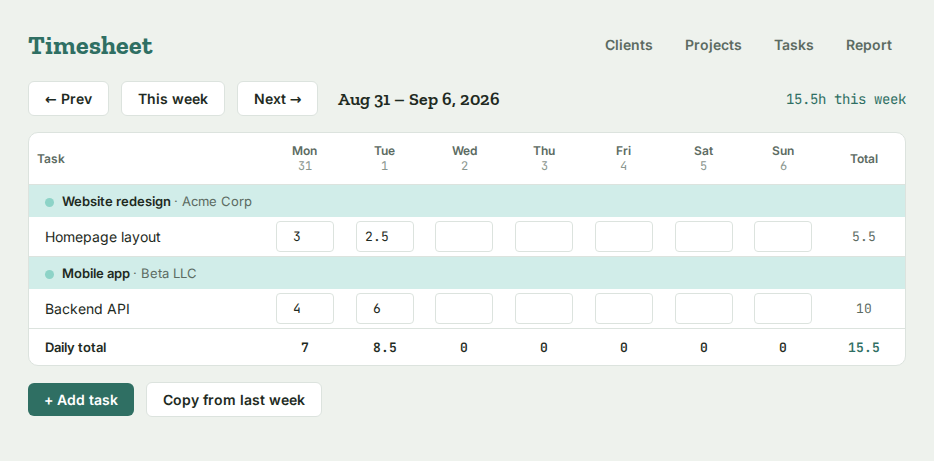
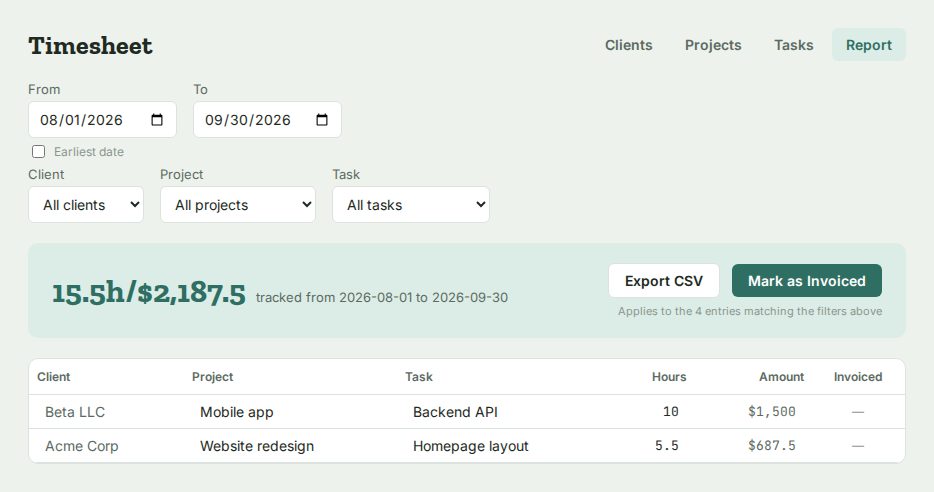
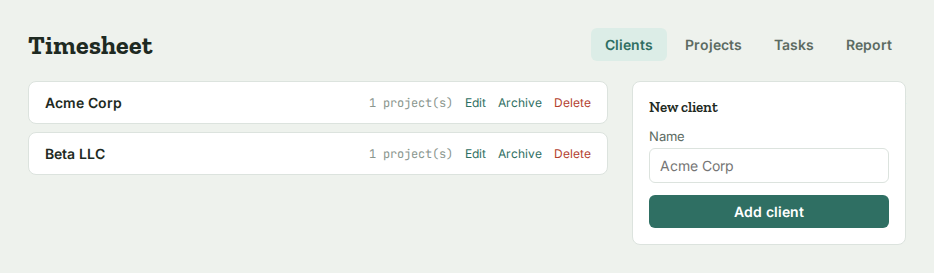
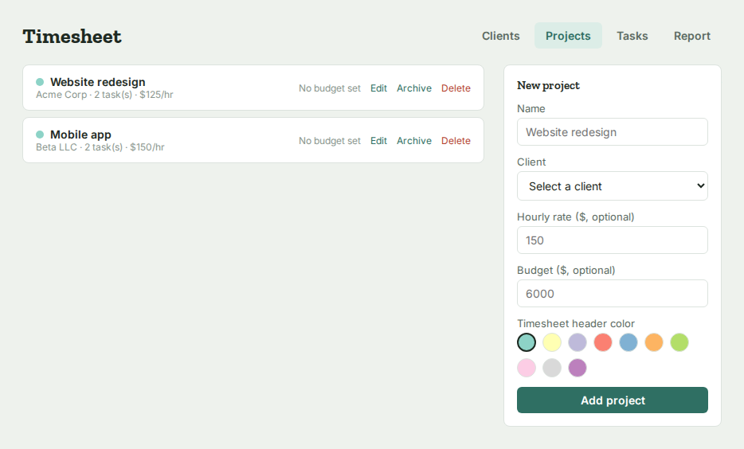
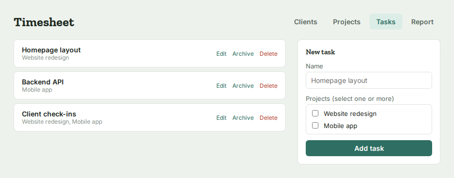

# Tally (Tauri)

A native-feeling macOS app built with Tauri: a Rust shell wrapping a small React
frontend, using the system webview (not a bundled Chromium), so the built app is
small. Single user, no network sync — data is plain JSON files on disk.

110% vibes.

## Screenshots

| Timesheet | Report |
| --- | --- |
|  |  |

| Clients | Projects | Tasks |
| --- | --- | --- |
|  |  |  |

## Requirements

- Node.js 18+ and npm
- Rust (install via https://rustup.rs)
- Xcode Command Line Tools: `xcode-select --install`
- Tauri's macOS prerequisites are covered by the above — see
  https://v2.tauri.app/start/prerequisites/ if `npm run tauri dev` complains about
  missing tools.

## Setup

```
cd tally-tauri
npm install
```

## Run in development

```
npm run tauri dev
```

This starts the Vite dev server and opens the app in a native window. Hot reload
works for the frontend; changes to Rust code (`src-tauri/src/*.rs`) trigger a
recompile.

## Build a distributable app

```
npm run tauri build
```

Before doing this for real distribution:

1. **Icons** — a placeholder icon set is included (`src-tauri/icons/`, a plain teal
   square) so the app builds and runs. Swap it for something you actually want
   people to see: generate a full icon set from a single square PNG (1024x1024
   recommended):
   ```
   npx tauri icon path/to/your-icon-1024.png
   ```
   This overwrites everything in `src-tauri/icons/` and updates the paths Tauri
   needs, including the `.icns` file macOS bundling wants (not included in the
   placeholder set — only needed for `tauri build`, not `tauri dev`).
2. **App identifier** — change `identifier` in `tauri.conf.json` from
   `com.example.tally` to something like `com.yourname.tally`.

The built `.app` (and `.dmg` on macOS) will be under
`src-tauri/target/release/bundle/`.

## Data storage

Two Rust commands (`read_json` / `write_json` in `src-tauri/src/lib.rs`) read and
write plain JSON files in the app's data directory:

```
~/Library/Application Support/com.example.tally/
  clients.json
  projects.json
  tasks.json
  time-entries.json
  timesheet-shown-rows.json
```

(The folder name follows whatever `identifier` you set in `tauri.conf.json`.)

Back up your data by copying that folder. For the full shape of each file —
field-by-field, including migration history — see
[`DATA_SCHEMA.md`](./DATA_SCHEMA.md).

## Project layout

```
tally-tauri/
  package.json, vite.config.js, vitest.config.js, index.html
  src/
    main.jsx       – React entry point
    App.jsx        – the whole app (ported from the in-chat artifact)
    storage.js     – wraps Tauri's invoke() to call the Rust read/write commands
    test/
      setup.js         – jest-dom matcher setup
      mockStorage.js   – in-memory stand-in for storage.js, used by tests
      dateHelpers.test.js
      format.test.js
      App.test.jsx
  src-tauri/
    Cargo.toml
    tauri.conf.json
    src/
      main.rs      – process entry point
      lib.rs       – the two commands, plus app setup
```

## Testing

```
npm install
npm test          # run once
npm run test:watch  # re-run on file changes
```

Two kinds of tests:

- **Unit tests** (`dateHelpers.test.js`, `format.test.js`) — the pure functions
  in `App.jsx` (week/month math, rounding, CSV escaping, color tinting) are
  exported alongside the default component export specifically so they can be
  imported and tested directly, with no rendering involved.
- **Integration tests** (`App.test.jsx`) — renders the real `App` component
  with React Testing Library and drives it via `@testing-library/user-event`,
  with `storage.js` swapped for an in-memory mock (`mockStorage.js`) so no
  Tauri runtime is needed. Covers: creating a client/project/task and logging
  hours, archiving/unarchiving, the two-step delete confirmation, hiding a
  task from a single week without affecting other weeks, and the Reports tab's
  filters and CSV export.

The Rust backend (`src-tauri/src/lib.rs`) is two thin file read/write
commands and isn't covered by this suite — if you want Rust-side tests too,
`cargo test` with a couple of unit tests around `data_dir` path handling
would be the natural next step.

## Note on fonts

The UI loads Zilla Slab / Inter / JetBrains Mono from Google Fonts over the
network. If you want the app to look right fully offline, swap the `@import` in
`App.jsx` for locally bundled font files — not done here to keep things simple.
